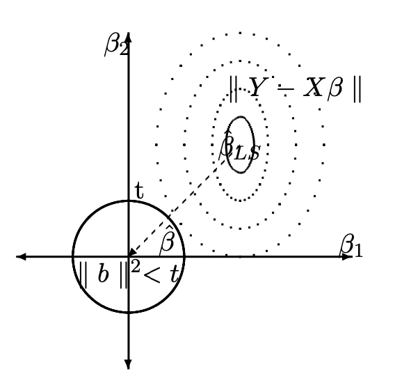
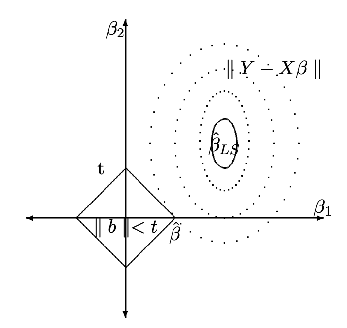
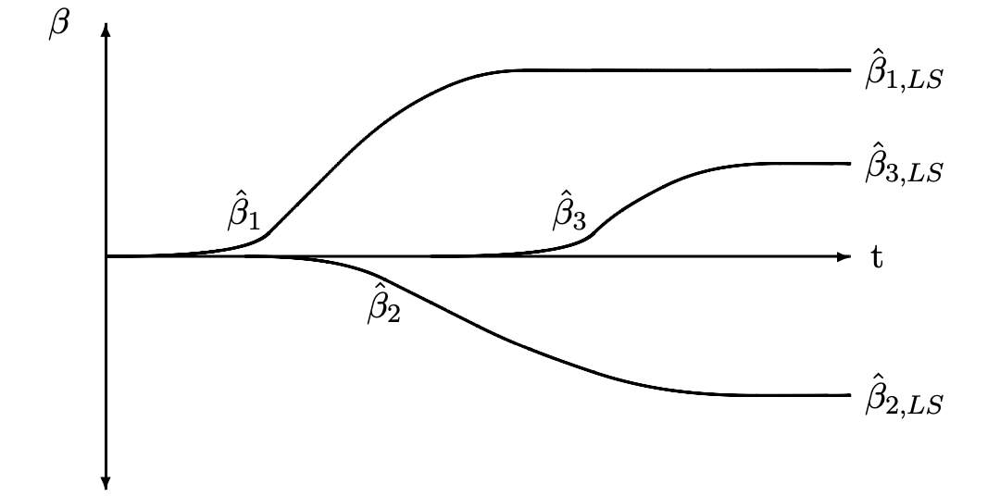

```{r setup, include=FALSE}
knitr::opts_chunk$set(echo = FALSE,message=FALSE,fig.align="center",fig.width=7,fig.height=2.5)
pacman::p_load(
       carx
      , ggplot2
      , ggExtra
      , reshape2
      , corrplot
      , RColorBrewer
      , lubridate
      , AmesHousing
      )
```

```{css,echo=FALSE}
.btn {
    border-width: 0 0px 0px 0px;
    font-weight: normal;
    text-transform: ;
}

.btn-default {
    color: #2ecc71;
    background-color: #ffffff;
    border-color: #ffffff;
}
button.btn.collapsed:before
{
    content:'+' ;
    display:block;
    width:15px;
}
button.btn:before
{
    content:'-' ;
    display:block;
    width:15px;
}
```

```{r,echo=FALSE}
# Global parameter
show_code <- TRUE
```

# Class Workbook {.tabset .tabset-fade .tabset-pills}

## In class activity

### Ames Housing data

Please take a look at the Ames Hoursing data.

```{r}
library(AmesHousing)
?ames_raw
```

### Questions

Use data of `ames_raw` up to 2008 predict the housing price for the
later years.

```{r,echo=show_code}
ames_raw_2008=ames_raw[ames_raw$`Yr Sold`<2008,]
ames_raw_2009=ames_raw[ames_raw$`Yr Sold`>=2008,]
```

Use the same loss function calculator.

```{r,echo=show_code}
calc_loss<-function(prediction,actual){
  difpred <- actual-prediction
  RMSE <-sqrt(mean(difpred^2))
  operation_loss<-abs(sum(difpred[difpred<0]))+sum(0.1*actual[difpred>0])
  return(
    list(RMSE,operation_loss
         )
  )
}
```

Here are few rules:

-   You are not allowed to use the test data.
-   Try 3 of the regularization methods discussed in Ch6.
-   You should use a resampling method that is most appropriate for
    choosing the hyper parameters.

Your code:

```{r,echo=TRUE}
selected <- ames_raw_2008[, c("Year Remod/Add", "Year Built" , "Lot Area" , "Garage Area", "Gr Liv Area", "SalePrice")]
selected <- na.omit(selected)
x <- as.matrix(selected[, c("Year Remod/Add", "Year Built" , "Lot Area" , "Garage Area", "Gr Liv Area")])
y <- selected$SalePrice
ridge_model <- glmnet(x = x, y = y, alpha = 0)
summary(ridge_model)
lasso_model <- glmnet(x = x, y = y, alpha = 1)
summary(lasso_model)
alpha_values <- seq(0, 1, by = 0.1)
lambdas <- c()
for (value in alpha_values) {
cv_fit <- cv.glmnet(x = x, y = y, alpha = value, nfolds = 5)
print(cv_fit$lambda.min)
}
#The best alpha is 1
```

Your answer:

```         
The best alpha for elastic model is 1, which is the lasso model. So the lasso is the best model.

```

-   For each of the models you've run, can you interpret which variable
    impacts the outcome the most? Are the results consistent across
    different methods?

Your code:

```{r,echo=TRUE}
coefficients_lasso <- coef(lasso_model)
coefficients_ridge <- coef(ridge_model)
```

Your answer:

```         
For lasso model, Year Built impacts the outcome the most since the coefficient for this variable is the largest.
For ridge model, also the Year Built impacts the outcome the most.

```

-   Try these methods with bootstrap, are the results consistent?

Your code:

```{r,echo=TRUE}
library(glmnet)
library(boot)

n_bootstraps <- 1000

generate_bootstrap_sample <- function(data) {
  n <- nrow(data)
  bootstrap_indices <- sample(1:n, replace = TRUE)
  return(data[bootstrap_indices, , drop = FALSE])
}

bootstrap_samples <- replicate(n_bootstraps, generate_bootstrap_sample(selected), simplify = FALSE)

bootstrap_df <- do.call(rbind, bootstrap_samples)
bootstrap_df <- bootstrap_df[1:1000, ]

x <- as.matrix(bootstrap_df[, c("Year Remod/Add", "Year Built", "Lot Area", "Garage Area", "Gr Liv Area")])
y <- bootstrap_df$SalePrice

ridge_model <- glmnet(x = x, y = y, alpha = 0)
ridge_coeffs <- coef(ridge_model)

lasso_model <- glmnet(x = x, y = y, alpha = 1)
lasso_coeffs <- coef(lasso_model)
  
list(ridge = coef(ridge_model), lasso = coef(lasso_model))
print(min(ridge_model$lambda))
print(min(lasso_model$lambda))


```

Your answer:

```         
The results are the same as before. Year Built affect the Salesprice most.

```

-   Based on all the models you've run, which result predicts the best?
    Which one is most easy to understand? Which method gives the most
    stable results?

Your code:

```{r,echo=TRUE}
print(min(ridge_model$lambda))
print(min(lasso_model$lambda))
```

Your answer:

```         
Lasso model predict the best. I think the original linear model is most easy to understand. And The bootstrap method should give the most stable results. 
```

## Problem Set

### Best Subset

In this exercise, we will generate simulated data, and will then use
this data to perform best subset selection.

(a) Use the `rnorm()` function to generate a predictor $X$ of length
    $n = 100$, as well as a noise vector $\epsilon$ of length $n = 100$.

Your code:

```{r,echo=TRUE}
set.seed(123)
n <- 100
X <- rnorm(n)
epsilon <- rnorm(n)
```

(b) Generate a response vector $Y$ of length $n = 100$ according to the
    model
    $$\mathbf{y} = \boldsymbol{\beta}_0 + \beta_1X + \beta2X^2 + \beta_3X^3 + \epsilon$$,
    where $\beta_{0}$ , $\beta_{1}$, $\beta_{2}$, and $\beta_{3}$ are
    constants of your choice.

Your code:

```{r,echo=TRUE}
beta0 <- 2
beta1 <- 3
beta2 <- 1.5
beta3 <- -0.5

Y <- beta0 + beta1*X + beta2*X^2 + beta3*X^3 + epsilon

```

(c) Use the `regsubsets()` function to perform best subset selection in
    order to choose the best model containing the predictors $X$,
    $X^{2},\dots,X^{10}$. What is the best model obtained according to
    $C_p$ , BIC, and adjusted $R^2$ ? Show some plots to provide
    evidence for your answer, and report the coefficients of the best
    model obtained. Note you will need to use the `data.frame()`
    function to create a single data set containing both $X$ and $Y$.

Your code:

```{r,echo=TRUE}
data <- data.frame(X = X, Y = Y)

library(leaps)

subset_model <- regsubsets(Y ~ poly(X, 10, raw = TRUE), data = data, nvmax = 10)

summary_subset <- summary(subset_model)

best_cp <- which.min(summary_subset$cp)
best_bic <- which.min(summary_subset$bic)
best_adj_r2 <- which.max(summary_subset$adjr2)

par(mfrow = c(1, 3))
plot(summary_subset$cp, xlab = "Number of Predictors", ylab = "Cp", main = "Cp Criterion", type = "l")
points(best_cp, summary_subset$cp[best_cp], col = "red", pch = 20)

plot(summary_subset$bic, xlab = "Number of Predictors", ylab = "BIC", main = "BIC Criterion", type = "l")
points(best_bic, summary_subset$bic[best_bic], col = "red", pch = 20)

plot(summary_subset$adjr2, xlab = "Number of Predictors", ylab = "Adjusted R^2", main = "Adjusted R^2 Criterion", type = "l")
points(best_adj_r2, summary_subset$adjr2[best_adj_r2], col = "red", pch = 20)

best_model <- coef(subset_model, id = best_adj_r2)
print(best_model)

```


(d) Repeat (c), using forward stepwise selection and also using
    backwards stepwise selection. How does your answer compare to the
    results in (c)?

Your code:

```{r,echo=TRUE}
forward_model <- step(lm(Y ~ poly(X, 10, raw = TRUE), data = data), direction = "forward")

backward_model <- step(lm(Y ~ poly(X, 10, raw = TRUE), data = data), direction = "backward")

summary_forward <- summary(forward_model)
summary_backward <- summary(backward_model)

cp_forward <- summary_forward$cp[which.min(summary_forward$cp)]
bic_forward <- summary_forward$bic[which.min(summary_forward$bic)]
adj_r2_forward <- summary_forward$adj.r.squared[which.max(summary_forward$adj.r.squared)]

cp_backward <- summary_backward$cp[which.min(summary_backward$cp)]
bic_backward <- summary_backward$bic[which.min(summary_backward$bic)]
adj_r2_backward <- summary_backward$adj.r.squared[which.max(summary_backward$adj.r.squared)]

best_cp <- summary_subset$cp[best_cp]
best_bic <- summary_subset$bic[best_bic]
best_adj_r2 <- summary_subset$adjr2[best_adj_r2]

cat("Forward Stepwise Selection:\n")
cat("Best Cp:", cp_forward, "\n")
cat("Best BIC:", bic_forward, "\n")
cat("Best Adjusted R^2:", adj_r2_forward, "\n\n")

cat("Backward Stepwise Selection:\n")
cat("Best Cp:", cp_backward, "\n")
cat("Best BIC:", bic_backward, "\n")
cat("Best Adjusted R^2:", adj_r2_backward, "\n\n")

cat("Best Subset Selection (Part c):\n")
cat("Best Cp:", best_cp, "\n")
cat("Best BIC:", best_bic, "\n")
cat("Best Adjusted R^2:", best_adj_r2, "\n\n")

```


(e) Now fit a lasso model to the simulated data, again using $X$,
    $X^{2},\dots, X^{10}$ as predictors. Use cross-validation to select
    the optimal value of $\lambda$. Create plots of the cross-validation
    error as a function of $\lambda$. Report the resulting coefficient
    estimates, and discuss the results obtained.

Your code:

```{r,echo=TRUE}
library(glmnet)
lasso_model <- cv.glmnet(as.matrix(poly(X, 10, raw = TRUE)), Y, alpha = 1)
plot(lasso_model)
best_lambda <- lasso_model$lambda.min
cat("Optimal lambda selected by cross-validation:", best_lambda, "\n")
lasso_fit <- glmnet(as.matrix(poly(X, 10, raw = TRUE)), Y, alpha = 1, lambda = best_lambda)
coef(lasso_fit)

```
Your answer:

```         
The selected optimal value of lambda will balance between model complexity (number of predictors) and goodness of fit.
The resulting coefficient estimates will indicate which predictors are important in the model and which ones have been shrunk towards zero by the Lasso penalty, effectively performing variable selection.

```

(f) Now generate a response vector Y according to the model
    $$Y = \beta_{0} + \beta_{7}X^{7} + \epsilon,$$and perform best
    subset selection and the lasso. Discuss the results obtained.

Your code:

```{r,echo=TRUE}
beta7 <- 0.1
Y_new <- beta0 + beta7*X^7 + epsilon
subset_model_new <- regsubsets(Y_new ~ poly(X, 10, raw = TRUE), data = data, nvmax = 10)
summary_subset_new <- summary(subset_model_new)
best_adj_r2_new <- which.max(summary_subset_new$adjr2)
best_model_new <- coef(subset_model_new, id = best_adj_r2_new)
lasso_model_new <- cv.glmnet(as.matrix(poly(X, 10, raw = TRUE)), Y_new, alpha = 1)
best_lambda_new <- lasso_model_new$lambda.min
lasso_fit_new <- glmnet(as.matrix(poly(X, 10, raw = TRUE)), Y_new, alpha = 1, lambda = best_lambda_new)
print(best_model_new)
coef(lasso_fit_new)

```

Your answer:

```         
Both models agree on the importance of X2, X7 and X10 as predictors.However, the best subset selection model includes additional terms like X4, X5 and X8 which the Lasso model considers less important and shrinks towards zero. Thus, the Lasso model provides a more conservative representation of the relationship between the predictors and the response variable, effectively performing variable selection.

```

### College

In this exercise, we will predict the number of applications received
using the other variables in the College data set.

```{r}
data(College,package = "ISLR2")
```

(a) Split the data set into a training set and a test set.

Your code:

```{r,echo=TRUE}
set.seed(123)

n <- nrow(College)

train_index <- sample(1:n, 0.8 * n, replace = FALSE)

train_data <- College[train_index, ]

test_data <- College[-train_index, ]
```

(b) Fit a linear model using least squares on the training set, and
    report the test error obtained.

Your code:

```{r,echo=TRUE}
lm_model <- lm(Apps ~ ., data = train_data)

predicted <- predict(lm_model, newdata = test_data)

test_error <- sqrt(mean((test_data$Apps - predicted)^2))
test_error
```

Your answer:

```         
The test error is 1449.199.

```

(c) Fit a ridge regression model on the training set, with $\lambda$
    chosen by cross-validation. Report the test error obtained.

Your code:

```{r,echo=TRUE}
X_train <- as.matrix(train_data[, -1])
Y_train <- train_data$Apps

ridge_model <- cv.glmnet(X_train, Y_train, alpha = 0, nfolds = 10)

X_test <- as.matrix(test_data[, -1]) 
predicted_ridge <- predict(ridge_model, newx = X_test, s = "lambda.min")

test_error_ridge <- sqrt(mean((test_data$Apps - predicted_ridge)^2))
test_error_ridge
```

Your answer:

```         
The test error of ridge model is 863.8801.

```

(d) Fit a lasso model on the training set, with $\lambda$ chosen by
    crossvalidation. Report the test error obtained, along with the
    number of non-zero coefficient estimates.

Your code:

```{r,echo=TRUE}
lasso_model <- cv.glmnet(X_train, Y_train, alpha = 1, nfolds = 10)

predicted_lasso <- predict(lasso_model, newx = X_test, s = "lambda.min")

test_error_lasso <- sqrt(mean((test_data$Apps - predicted_lasso)^2))

num_nonzero_coef <- sum(coef(lasso_model, s = "lambda.min") != 0)

test_error_lasso
num_nonzero_coef
```

Your answer:

```         
Test error for lasso model is 158.2043, and the number of non-zero coefficient estimates is 2.

```

(e) Fit a PCR model on the training set, with M chosen by
    crossvalidation. Report the test error obtained, along with the
    value of M selected by cross-validation.

Your code:

```{r,echo=TRUE}
library(pls)

pcr_model <- pcr(Apps ~ ., data = train_data, validation = "CV")

validationplot(pcr_model, val.type = "MSEP")

pcr.pred = predict(pcr_model, test_data, ncomp=16)
mean((pcr.pred-test_data$Apps)^2)
```

Your answer:

```         
Test MSE for M=16 is 2082584, which is much larger than least squares.

```

(f) Fit a PLS model on the training set, with M chosen by
    crossvalidation. Report the test error obtained, along with the
    value of M selected by cross-validation.

Your code:

```{r,echo=TRUE}
pls_model <- plsr(Apps ~ ., data = train_data, validation = "CV")

validationplot(pls_model, val.type="MSEP")

pls.pred = predict(pls_model, test_data, ncomp=8)
err.pls = mean((pls.pred-test_data$Apps)^2)
err.pls
```

Your answer:

```         
The test MSE is similar to PCR and slightly lower than least squares.

```

(g) Comment on the results obtained. How accurately can we predict the
    number of college applications received? Is there much difference
    among the test errors resulting from these five approaches?


Your answer:

```         
All the models give reasonably similar results, with PCR and PLS giving slightly lower test MSE's.

```

### Features

We have seen that as the number of features used in a model increases,
the training error will necessarily decrease, but the test error may
not. We will now explore this in a simulated data set.

(a) Generate a data set with (p = 20) features, (n = 1,000)
    observations, and an associated quantitative response vector
    generated according to the model
    $$\mathbf{y} = \mathbf{X}\boldsymbol{\beta} + \boldsymbol{\epsilon}$$,
    where ($\boldsymbol{\beta}$) has some elements that are exactly
    equal to zero.

Your code:

```{r,echo=TRUE}
set.seed(123)

n = 1000
p = 20
X = matrix(rnorm(n*p), n, p)
B = sample(-10:10, 20)
B[1] = 0
B[4] = 0
B[7] = 0
B[11] = 0
B[15] = 0
B[19] = 0
e = rnorm(1000, mean=0, sd=0.1)

Y = X%*%B + e 

df = data.frame(X, Y)
```


(b) Split your data set into a training set containing (100)
    observations and a test set containing (900) observations.

Your code:

```{r,echo=TRUE}
library(caTools)
sample = sample.split(df$Y, 0.10)
train = subset(df, sample==T)
test = subset(df, sample==F)
```


(c) Perform best subset selection on the training set, and plot the
    training set MSE associated with the best model of each size.

Your code:

```{r,echo=TRUE}
regfit.full = regsubsets(Y~., data=train, nvmax=20)
reg.summary = summary(regfit.full)
train.mse = (reg.summary$rss)/length(train)
plot(1:20,train.mse,xlab = "Variables",ylab = "Training MSE", main = "Training MSE v Number of Variables", pch = 1, type = "b")
```

Your answer:

```         
Training MSE decreases monotonically as the number of variables increase.

```

(d) Plot the test set MSE associated with the best model of each size.

Your code:

```{r,echo=TRUE}
library(HH)
test.mse = rep(NA,20)

for(i in 1:20){
    model=lm.regsubsets(regfit.full, i)
    model.pred = predict(model, newdata=test, type=c("response"))
    test.mse[i] =  mean((test$Y-model.pred)^2)
}
plot(1:20,test.mse,xlab = "Variables",ylab = "Test MSE",main = "Test MSE v Number of Variables", pch = 1, type = "b")

```

Your answer:

```         
Test MSE decreases rapidly as the number of variables increase, but the minimum is not at the max number of variables.

```

(e) For which model size does the test set MSE take on its minimum
    value? Comment on your results. If it takes on its minimum value for
    a model containing only an intercept or a model containing all of
    the features, then play around with the way that you are generating
    the data in (a) until you come up with a scenario in which the test
    set MSE is minimized for an intermediate model size.


Your answer:

```         
Minimum Test MSE occurs at a model with 13 variables. The test MSE deceases rapidly until it reaches the minimum and then starts to rise thereafter. 
As the model flexibility increases, it is better able to fit the data set. This results in the Test MSE decreasing rapidly until it reaches a minimum. Thereafter, further increases in model flexibility causes over fitting and hence results in an increase in the Test MSE.
  

```

(f) How does the model at which the test set MSE is minimized compare to
    the true model used to generate the data? Comment on the coefficient
    values.

Your code:

```{r,echo=TRUE}
coef(regfit.full, 13)
B
```

Your answer:

```         
Best model variables exactly match the 13 non-zero variables from the original model, and their respective coefficients are highly similar.

```

(g) Create a plot displaying
    $\sqrt{\Sum_{j=1}^{p}(\beta_{j}-\hat{\beta}_{j}^{r})^{2}}$ for a
    range of values of ($r$), where $\hat{\beta}_{j}^{r}$ is the $j$th
    coefficient estimate for the best model containing ($r$)
    coefficients. Comment on what you observe. How does this compare to
    the test MSE plot from (d)?

Your code:

```{r,echo=TRUE}
B = as.data.frame(t(B))
names(B) = paste0('X', 1:(ncol(B)))
coef.err = rep(NA,20)
for (i in 1:20){
  a = coef(regfit.full, i)
  coef.err[i] = sqrt(sum(((a[-1] - B[names(a)[-1]])^2)))
}

plot(1:20,coef.err,xlab = "Variables",ylab = "Coef error", main="Coefficient Error v Number of Variables.", pch = 1, type = "b")
```

Your answer:

```         
The chart starts disjointedly before coefficients rapidly reduce. It eventually reaches a minimum at the same variable size as the test MSE. However, with different random seeds, the coefficient error chart doesn't always minimize at the same variable size as the test MSE chart. Therefore, a minimum coefficient error model doesn't always result in lower test MSE.

```

### Boston

We will now try to predict per capita crime rate in the Boston data set.

```{r}
data(Boston,package = "MASS")
```

(a) Try out some of the regression methods explored in this chapter,
    such as best subset selection, the lasso, ridge regression, and PCR.
    Present and discuss results for the approaches that you consider.

Your code:

```{r,echo=TRUE}
set.seed(121)

x = model.matrix(crim~.,Boston)[,-1]
y = Boston$crim
grid = 10^seq(10,-2,length=100)

train = sample(1:nrow(x), nrow(x)/1.3)
test = (-train)
y.test = y[test]
set.seed(121)
cv.out = cv.glmnet(x[train,], y[train], alpha=1)
bestlam = cv.out$lambda.min

lasso.mod = glmnet(x[train,],y[train],alpha=1,lambda=grid)
lasso.pred = predict(lasso.mod, s=bestlam, newx=x[test,])
mean((lasso.pred-y.test)^2)

lasso.coef = predict(lasso.mod, type="coefficients", s=bestlam)[1:13,]
lasso.coef
```

Your answer:

```         
Test MSE of 31.6, with only age and tax being exactly zero, we have a best model with 10 variables.


```

(b) Propose a model (or set of models) that seem to perform well on this
    data set, and justify your answer. Make sure that you are evaluating
    model performance using validation set error, crossvalidation, or
    some other reasonable alternative, as opposed to using training
    error.

Your code:


Your answer:

```         
I would choose the Lasso model, as it gives the lowest test mse. 
```

(c) Does your chosen model involve all of the features in the data set?
    Why or why not?


Your answer:

```         
No, two features whose effect on the response were below the required threshold were removed.
  
```

\~\~\~

## Additional Material

### [Advanced] Regularized Regression using Predictive Modeling Platforms in R

As always, here are ways to fit regularized regression with the usual 4
packages. - mlr3 (<https://mlr3book.mlr-org.com>) - tidymodels
(<https://www.tidymodels.org/>) - caret
(<https://topepo.github.io/caret/>) - h2o
(<https://docs.h2o.ai/h2o/latest-stable/h2o-r/docs/index.html>)

```{r,echo=show_code}
# split the data
index <- sample(1:nrow(ames_raw), 0.7*nrow(ames_raw))
vars <- c("SalePrice","Lot Area","Gr Liv Area","Full Bath")
train <- ames_raw[ index, vars]
test  <- ames_raw[-index, vars]
colnames(train) <- make.names(colnames(train))
colnames(test)  <- make.names(colnames(test))

# mlr3 TaskRegr
train$SalePrice <- log(train$SalePrice)
```

#### Regularized regression using mlr3

```{r,echo=show_code}
# load packages and data
library(mlr3)
library(mlr3learners)

# fit a model

task <- as_task_regr(train, target ="SalePrice",id = "ames_raw")

# TaskRegr$new(id = "ames_raw", backend = train, target ="SalePrice")
learner <- lrn("regr.glmnet", predict_type = "response",alpha=0)
learner$train(task)
prediction=predict(learner,newdata=test)
```

#### Regularized regression using [tidymodels](https://www.tidymodels.org/)

```{r,echo=show_code}
# load packages and data
library(tidymodels)
library(dotwhisker)
# fit a model

norm_recipe <- 
  recipe(
    SalePrice ~ ., data = train
  ) %>%  prep(training = train, retain = TRUE)
# Now let's fit the model using the processed version of the data

coef_path_values <- c(0, 10^seq(from=-7,to=-1,length=100))
glmn_fit <- 
  linear_reg(penalty = 0.001, mixture = 0) %>% 
  set_engine("glmnet", path_values = coef_path_values) %>%
  fit(SalePrice ~ ., data = bake(norm_recipe, new_data = NULL))

test_normalized <- bake(norm_recipe, new_data = test, all_predictors())

test_results <- predict(glmn_fit, new_data = test_normalized)


```

#### Regularized regression using caret

```{r,echo=show_code}
# load packages and data
library(caret)

# setup grid
L2Grid <- expand.grid(alpha=0,lambda=10^seq(from=-7,to=-1,length=100))
# fit a model
ctrl <- trainControl(method = "CV")
glmnet_model <- train(SalePrice ~ ., data = train, method = "glmnet", trControl = ctrl,tuneGrid = L2Grid)
ggplot(glmnet_model)
glmnet_model %>% summary %>% print
coef(glmnet_model$finalModel, glmnet_model$bestTune$lambda) %>% print
prediction=predict(glmnet_model,newdata = test)

```

#### Regularized regression using h2o

```{r,echo=show_code,eval=FALSE}
# load packages and data
library(h2o)
packageVersion("h2o")
localH2O <- h2o.init(nthreads = -1, max_mem_size="4g") # Starting H2O
train_hf <- as.h2o(train) # Serving the data to H2O
test_hf <- as.h2o(test)
```

##### Fitting Ridge regression

```{r h2o_fit_glm,echo=show_code,eval=FALSE}
# https://github.com/barupal/hands-on-machine-learning-with-r/blob/master/03-regularized-glm-models.Rmd
# create hyperparameter grid
hyper_params <- list(alpha=0,lambda=10^seq(from=-7,to=-1,length=10))

# perform grid search
grid <- h2o.grid(y = "SalePrice",                               #response variable 
                 x = c("SalePrice","Lot.Area","Gr.Liv.Area","Full.Bath"),  #predictor variables
                training_frame = train_hf, 
                nfolds = 5,
                keep_cross_validation_predictions = TRUE,
                algorithm = "glm",
                grid_id = "grid_search", 
                hyper_params = hyper_params
)
# Sort the grid models by MSE
sorted_grid <- h2o.getGrid("grid_search", sort_by = "mse", decreasing = FALSE)
sorted_grid
best_h2o_model <- sorted_grid@model_ids[[1]]
best_model <- h2o.getModel(best_h2o_model)
# assess performance
h2o.mse(best_model)
h2o.rmse(best_model)
# get optimal parameters
best_model@parameters$lambda
best_model@parameters$alpha

prediction=predict(best_model,newdata = test_hf)
#h2o.exportFile(prediction, "/tmp/pred.csv", force = TRUE) #export prediction result as a file

h2o.shutdown(prompt =F) 
```

## Advanced Content

### Stein's Estimator and shrinkage

So far, we have seen how least squares perform well, even in cases where
the true model is not linear. Then, the natural question we may ask is,
can we find an estimator that is better than least squares? Which
@stein1956inadmissibility worked on, and later @james1961estimation
improved upon. It is called the James-Stein estimator or just Stein's
estimator.

Stein's estimator is defined as
\footnote{In general Stein estimator is $(1-\alpha)\hat{\boldsymbol{\beta}}_{LS}$ for some positive number $\alpha$ less than 1.  }
$$\tilde{\boldsymbol{\beta}}_{stein}=\left(1-\frac{(p-2)\sigma^2}{\parallel \hat{\boldsymbol{\beta}}_{LS}\parallel^2}\right)\hat{\boldsymbol{\beta}}_{LS}$$.

According to Stein, for $p>2$ \begin{eqnarray*}
E\parallel \tilde{\boldsymbol{\beta}}_{stein} - \boldsymbol{\beta}_{best}\parallel^2\leq E\parallel \tilde{\boldsymbol{\beta}}_{LS} -\boldsymbol{\beta}_{best}\parallel^2
\end{eqnarray*}

To put it in simple English, the estimator obtained by shirking the LS
estimator by
$\left(1-\frac{(p-2)\sigma^2}{\parallel \hat{\boldsymbol{\beta}}_{LS}\parallel^2}\right)$
is a better estimator than LS. This is puzzling if you think carefully
about it, given that LS is BLUE. Also, there is not even a tuning
parameter. The only thing that seems to matter is
$\frac{\sigma^2}{\parallel \hat{\boldsymbol{\beta}}_{LS}\parallel^2}$.
The proof is not hard; you can find it at the bottom. But the important
takeaway message is that we can do better than LS by shrinking the
estimates.

### Methods to Control Model Complexity

Regression is used for a variety of problems - prediction: stock price
in the future - estimation: denoising, smoothing - understanding: figure
out what variable(s) are important

A critical characteristic in all situations is that we want a
generalizable model. Thus, we often prefer a simpler model over a
complex model (why?). This principle is called Occam's razor. (Note that
a simpler model does not guarantee generalizability. ) What methods are
available for us to control the model complexity?

For orthogonal $X_j$ $j=1,\cdots,p$, we can use the shrinkage method as
we saw in the Stein estimator
$$\tilde{\boldsymbol{\beta}}=\hat{\boldsymbol{\beta}}_{LS}\left(1-\frac{(p-2)\sigma^2}{\parallel\hat{\boldsymbol{\beta}}_{LS}\parallel^2}\right)$$

Another method is to use a threshold. There is hard thresholding, where
we set all the coefficients that do not pass a certain threshold to
zero. \begin{eqnarray}
\tilde{\beta}_j=\hat{\beta}_j1_{\hat{\beta}_j>\lambda}=\left\{ \begin{array}{ll}
\hat{\beta}_j & \mid\hat{\beta}_j\mid > \lambda\\
0 &\verb|otherwise|\\
\end{array}
\right.
\end{eqnarray} An alternative is soft thresholding, where we combine
shrinkage with hard thresholding. \begin{eqnarray}
\tilde{\beta}_j=sgn(\hat{\beta}_j)[\mid\hat{\beta}_j\mid-\lambda]_{+}=\left\{ \begin{array}{ll}
\tilde{\beta}_j=\hat{\beta}_j-\lambda & \verb|if |\mid\hat{\beta}_j\mid > \lambda\\
\tilde{\beta}_j=0 & \verb|if |\mid\hat{\beta}_j\mid \leq \lambda \\
\end{array}
\right.
\end{eqnarray}

But what can we do in a more general case where $X$ is not orthogonal or
$p$ is bigger than $n$? One popular thing nowadays is putting a penalty
or constraint on the model complexity. The two most popular ways are the
subset selection and shrinkage methods.

#### subset selection

Subset selection is most commonly done by restricting the number of none
zero $\tilde{\beta}_j$ to be less than some constant $k$. But solving
that is unfeasible when $p$ is large since it is an N-P hard problem. In
the orthogonal $X$ situation, ordering the $\tilde{\beta}_j$ and
choosing $k$ largest subset selection is equivalent to hard
thresholding.

#### Shrinkage

For general $X$, we can also perform shrinkage. The idea is to minimize
$\parallel \mathbf{y}-\mathbf{X}\boldsymbol{\beta}\parallel^2$ subject
to some constraint. When we set the constraint as
$\parallel\boldsymbol{\beta}\parallel^2<t$, the result is called the
ridge regression. Similarly, if we choose the constraint as
$\mid\boldsymbol{\beta}\mid<t$, then the result is known as the LASSO
(Least Absolute Shrinkage and Selection Operator) regression. It turns
out that this constrained minimization problem can be generalized to
minimizing an objective function of the form
$\parallel \mathbf{y}-\mathbf{X}\boldsymbol{\beta} \parallel^2+\lambda \parallel \boldsymbol{\beta} \parallel_{L_p}$
where $\parallel \parallel_{L_p}$ is called the $L_p$ norm and $\lambda$
is the complexity parameter that controls the amount of shrinkage.

##### Ridge Regression

Ridge Regression is used when you don't have collinearity in your
predictor variables. We can consider it a constraint optimization under
the $l_2$ norm or shrinkage estimation. So, for a general setting:

| observation | predictor 1      | predictor 2      | $\cdots$ | predictor p      | response     |
|------------|------------|------------|------------|------------|------------|
| 1           | $x_{11}$         | $x_{12}$         | $\cdots$ | $x_{1p}$         | $y_1$        |
| 2           | $x_{21}$         | $x_{22}$         | $\cdots$ | $x_{2p}$         | $y_2$        |
| $\vdots$    | $\vdots$         | $\vdots$         | $\ddots$ | $\vdots$         | $\vdots$     |
| n           | $x_{n1}$         | $x_{n2}$         | $\cdots$ | $x_{np}$         | $y_n$        |
|             | $\mathbf{X}_{1}$ | $\mathbf{X}_{2}$ | $\cdots$ | $\mathbf{X}_{p}$ | $\mathbf{y}$ |

$$
\mathbf{X}=\left[
\begin{array}{cccc}
\mathbf{X}_{1}&\mathbf{X}_{2}&\cdots &\mathbf{X}_{p} \\
\end{array}
\right]\verb|, and |
\boldsymbol{\beta}=\left[
\begin{array}{c}
\beta_{1} \\
\vdots\\
\beta_{p} \\
\end{array}
\right]
$$

To find the ridge regression estimate, we want to minimize the objective
function of form
$\left(\parallel \mathbf{y}-\mathbf{X}\boldsymbol{\beta} \parallel^2+\lambda\parallel \boldsymbol{\beta}\parallel^2\right)$.
As constrained optimization, we want to minimize
$\parallel \mathbf{y}-\mathbf{X}\beta \parallel^2$ subject to
$\parallel \boldsymbol{\beta} \parallel^2 \leq t$ constraint for some
constant $t$.

Imagine a contour defined by
$\parallel \mathbf{y}-\mathbf{X}\boldsymbol{\beta} \parallel^2$ with its
lowest at $\hat{\boldsymbol{\beta}}_{LS}$. Now imagine a circle around
the origin where the diameter is defined by a tuning parameter $t$ such
that it satisfies $\parallel \boldsymbol{\beta} \parallel^2 <t$. Our
solution can only be inside this circle. Without any constraint on $t$,
i.e. $t=\infty$ we will get $\hat{\boldsymbol{\beta}}_{LS}$ as an
estimate that minimizes
$\parallel \mathbf{y}-\mathbf{X}\beta \parallel^2$. But as t gets
smaller, we depart from our $\hat{\boldsymbol{\beta}}_{LS}$ since the
solution has to be within the circle. Thus, we can see that the solution
we want is on the circle closest to $\hat{\boldsymbol{\beta}}_{LS}$,
which is the point circle that touches the ellipse. Equivalently, our
solution can be thought of as shrinkage. As t gets smaller, we are
shrinking our $\hat{\boldsymbol{\beta}}_{LS}$ toward zero on the
diagonal line from $\hat{\boldsymbol{\beta}}_{LS}$ to the origin.



So lets solve for
$\parallel \mathbf{y}-\mathbf{X}\boldsymbol{\beta} \parallel^2+\lambda \parallel \boldsymbol{\beta} \parallel^2$
\begin{eqnarray*}
\frac{\partial }{\partial \boldsymbol{\beta}}\parallel \mathbf{y}-\mathbf{X}\boldsymbol{\beta} \parallel^2+\lambda \parallel \boldsymbol{\beta} \parallel^2&=&-2( \mathbf{y}-\mathbf{X}\boldsymbol{\beta})X +2\lambda\boldsymbol{\beta}\\
&\Rightarrow&  -\mathbf{y}^T\mathbf{X}+\hat{\boldsymbol{\beta}}\mathbf{X}^T\mathbf{X} + \lambda\hat{\boldsymbol{\beta}}=0\\
&=& \hat{\boldsymbol{\beta}}(\mathbf{X}^T\mathbf{X} +\lambda I)=\mathbf{y}^TX\\
&=& \hat{\boldsymbol{\beta}}=(\mathbf{X}^T\mathbf{X} +\lambda I)^{-1}\mathbf{y}^TX\\
\end{eqnarray*} Hence we see
$\hat{\boldsymbol{\beta}}_{ridge}=(\mathbf{X}^T\mathbf{X} +\lambda \mathbf{I})^{-1}\mathbf{y}^T\mathbf{X}$.

##### LASSO (Least Absolute Shrinkage and Selection Operator)

The idea of LASSO is similar to Ridge Regression. Using the same setting
as before, the only difference is we want to minimize an objective
function of the form
$\left(\parallel \mathbf{y}-\mathbf{X}\boldsymbol{\beta} \parallel^2+\lambda\mid \boldsymbol{\beta}\mid\right)$
or equivalently perform constraint minimization of
$\parallel \mathbf{y}-\mathbf{X}\boldsymbol{\beta} \parallel^2$ subject
to $\mid \boldsymbol{\beta} \mid\leq t$ constraint
($\mid \boldsymbol{\beta} \mid=\sum^p_{j=1}\mid \beta_j\mid$).

Geometrically speaking (for $p=2$ case) we want to find
$\hat{\boldsymbol{\beta}}$ that is closest to
$\hat{\boldsymbol{\beta}}_{LS}$ within the diamond shaped region that is
$\mid \boldsymbol{\beta} \mid<t$. Unlike $L_2$ norm, $L_1$ norm has
corners and edges that touch the contour of
$\parallel \mathbf{y}-\mathbf{X}\boldsymbol{\beta} \parallel^2$ first
most of the time. This acts as the variable selector in high-dimensional
space. Thus, when we look at the solution path of LASSO, we see some
coefficients take on the value of zero.



As $t$ increases, we gradually see more and more $\boldsymbol{\beta}$s
coming into our model. And this goes on until all $t$ is so big that the
diamond shaped region includes $\hat{\boldsymbol{\beta}}_{LS}$, in which
case, all the estimates of $\hat{\boldsymbol{\beta}}$ becomes
$\hat{\boldsymbol{\beta}}_{LS}$. Or conversely, if you decrease your
$t$, to zero your estimated $\hat{\boldsymbol{\beta}}$ starts to get
shrunk toward zero from $\hat{\boldsymbol{\beta}}_{LS}$. So you can see
that we are doing shrinkage estimation. Then, we want to choose $t$ to
get the sparsest model with the lowest cross-validation error.



### Proofs

#### Stein's lemma

We first need Stein's lemma.\` \noindent{\bf Stein's Lemma} According to
Stein's lemma, for $Z\sim N\left(\mu,\sigma^2\right)$,
$E\left[(z-\mu)g(z)\right]=\sigma^2E\left[g'(z)\right]$.

\subsubsection*{proof}

```{=tex}
\begin{eqnarray*}
E\left[(z-\mu)g(z)\right]&=&\int(z-\mu)g(z)\frac{1}{\sqrt{2\pi\sigma^2}}e^{\frac{-(z-\mu)^2}{2\sigma^2}}dz\\
&=&-\sigma^2g(z)\frac{1}{\sqrt{2\pi\sigma^2}}e^{\frac{-(z-\mu)^2}{2\sigma^2}}\Bigr|^{\infty}_{-\infty}+\sigma^2\int g'(z)\frac{1}{\sqrt{2\pi\sigma^2}}e^{\frac{-(z-\mu)^2}{2\sigma^2}}\\
&=&\sigma^2E\left[g'(z)\right]
\end{eqnarray*}
```
#### Proof: Stein's estimator outperforms LS

We are ready to prove that Stein's estimator outperforms the least
square's estimate. We will denote for the simplicity
$\hat{\boldsymbol{\beta}}_{LS} = \boldsymbol{\beta}$ and
$\boldsymbol{\beta}_{best} =\boldsymbol{\theta}$. \begin{eqnarray*}
E\parallel \boldsymbol{\beta}-\boldsymbol{\theta} \parallel ^2&=&E\left[\sum^p_{i=1}\left( \beta_i-\theta_i \right)^2\right]\\
&=&p\sigma^2
\end{eqnarray*} \begin{eqnarray*}
E\left[\Biggl|\Biggl|\left(1-\frac{(p-2)\sigma^2}{\parallel \boldsymbol{\beta}\parallel^2}\right)\boldsymbol{\beta} -\boldsymbol{\theta} \Biggr|\Biggr| ^2\right]&=&E\left[\Biggl|\Biggl| (\boldsymbol{\beta}-\boldsymbol{\theta})-\frac{(p-2)\sigma^2}{\parallel \boldsymbol{\beta}\parallel^2}\boldsymbol{\beta}\Biggr|\Biggr|^2\right]\\
&=&E\parallel\boldsymbol{\beta}-\boldsymbol{\theta}\parallel^2+E\left[\frac{(p-2)^2\sigma^4}{\parallel \boldsymbol{\beta}\parallel^2}\right]-2E\left[ \langle \boldsymbol{\beta}-\boldsymbol{\theta}, \frac{(p-2)\sigma^2}{\parallel \boldsymbol{\beta}\parallel^2}\boldsymbol{\beta} \rangle \right]=(*)\\
\end{eqnarray*} Since
$E\left[ \langle \boldsymbol{\beta}-\theta, \frac{(p-2)\sigma^2}{\parallel \boldsymbol{\beta}\parallel^2}\boldsymbol{\beta} \rangle \right]$
can be simplified as follows \begin{eqnarray*}
E\left[\sum^p_{i=1}(\boldsymbol{\beta}_i-\theta_i)\frac{(p-2)\sigma^2}{\parallel \boldsymbol{\beta}\parallel^2}\boldsymbol{\beta}_i \right] &=& E\left[\sum^p_{i=1}(\boldsymbol{\beta}_i-\theta_i)\frac{(p-2)\sigma^2}{ \boldsymbol{\beta}_i^2+\sum^p_{j\neq i} \boldsymbol{\beta}_j^2}\boldsymbol{\beta}_i \right]\\
\end{eqnarray*} Letting
$\frac{(p-2)\sigma^2}{ \boldsymbol{\beta}_i^2+\sum^p_{j\neq i} \boldsymbol{\beta}_j^2}\boldsymbol{\beta}_i=g(x_i)$,
we can use Stein's lemma. Hence \begin{eqnarray*}
 E\left[\sum^p_{i=1}(\beta_i-\theta_i)\frac{(p-2)\sigma^2}{ \beta_i^2+\sum^p_{j\neq i} \beta_j^2}\beta_i \right]&=& \sigma^2\sum^p_{i=1}E\left[\left(\frac{(p-2)\sigma^2}{ \beta_i^2+\sum^p_{j\neq i} \beta_j^2}\beta_i \right)'\right]\\
&=&\sigma^2\sum^p_{i=1} E\left[\frac{(p-2)\sigma^2}{ \parallel \boldsymbol{\beta}\parallel^2}- \frac{(p-2)\sigma^2 2\beta_i^2}{ \parallel \boldsymbol{\beta}\parallel^2}\right]\\
&=&\sigma^2E\left[\frac{p(p-2)\sigma^2}{ \parallel \boldsymbol{\beta}\parallel^2}- \frac{2(p-2)\sigma^2}{ \parallel \boldsymbol{\beta}\parallel^2}\right]\\
&=&E\left[\frac{(p-2)^2\sigma^4}{\parallel \boldsymbol{\beta}\parallel^2}\right]
\end{eqnarray*}

Therefore: \begin{eqnarray*}
(*)&=&E\left[\parallel\boldsymbol{\beta}-\boldsymbol{\theta}\parallel^2+\frac{(p-2)^2\sigma^4}{\parallel \boldsymbol{\beta}\parallel^2}-2\frac{(p-2)^2\sigma^4}{\parallel \boldsymbol{\beta}\parallel^2}\right]\\
&=&E\left[\parallel\boldsymbol{\beta}-\boldsymbol{\theta}\parallel^2-\frac{(p-2)^2\sigma^4}{\parallel \boldsymbol{\beta}\parallel^2}\right]\leq E\left[\parallel\boldsymbol{\beta}-\boldsymbol{\theta}\parallel^2\right] = p\sigma^2
\end{eqnarray*}

### Reference
